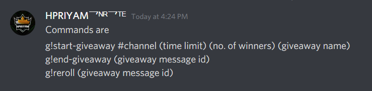
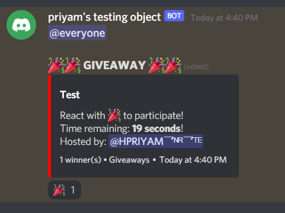
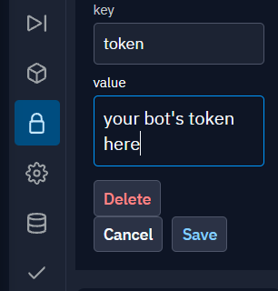

# Giveaways Bot

🎁Giveways Bot using the [discord-giveaways](https://npmjs.com/discord-giveaways) package!

## Features

* `start-giveaway` command
* `reroll-giveaway` command
* `end-giveaway` command

</img>
</img>
</img>

* Fill configuration (config.json):
```json
{
    "token": "make a secret called token and value paste the token"
    "prefix": "g!",
    "everyoneMention": true,
    "hostedBy": true
}
```

* Install dependencies:
```sh
npm install
```

* Start:
```sh
node index.js
```
My Discord - https://discord.gg/uk6uKq9TwV

My YouTube - https://www.youtube.com/channel/UC7qafOskW29jT80wabWgCNg
My github - https://github.com/hpriyam8